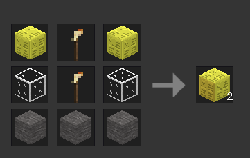
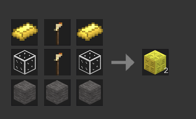
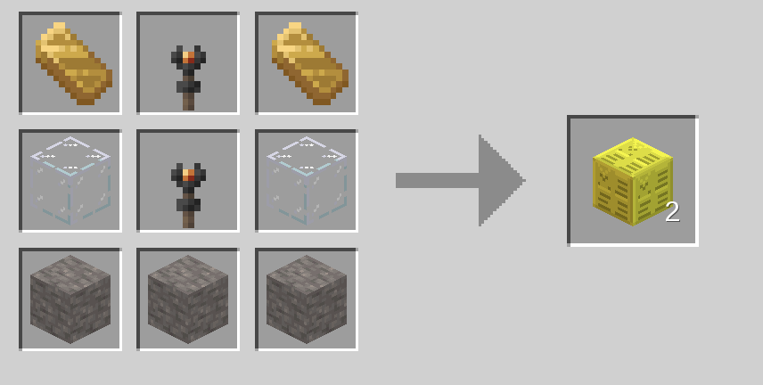

# ⚓ Lighthouse Lamp: Illuminate the Night Sky!

Bring your coastlines, harbors, and mountaintops to life with the **Lighthouse Lamp** mod for Luanti (Minetest)! 

This mod adds a powerful, high-performance lighthouse beacon that casts a beautiful, rotating light beam across the landscape all night long. It's the perfect functional decoration for any maritime build or mountain outpost.

---

## ⚡ Key Features

* **💫 Sweeping Night Beacon:** As soon as dusk falls, the lamp projects a stunning, rotating beam of particles that rotates 360 degrees to scan the sea.
* **☀️ Automatic Day/Night Cycle:** The rotating beam automatically stops at sunrise and wakes up again at sunset, behaving exactly like a real lighthouse.
* **🌟 Maximum Light Emission:** Emits a bright level-14 light source to keep your port safe, bright, and free of hostile mobs.
* **🛠️ Highly Craftable:** Multiple recipes using gold, Mese, or glowstone, making it highly accessible in survival gameplay.
* **📦 Clean & Performance-Friendly:** Built to look gorgeous while remaining extremely lightweight on server performance.

---

## 🛠️ Crafting Recipes / Recetas de crafteo

Crafting Lighthouse Lamps is easy and supports multiple materials (each recipe yields **2 lamps** / cada receta produce **2 lámparas**).

---

### Minetest Game (MTG) Recipes / Recetas de Minetest Game

**Option A (Mese Blocks / Bloques de Mese) - Yields 2:**
```text
[Mese Block]  [Torch]  [Mese Block]
[Glass]       [Torch]  [Glass]
[Stone]       [Stone]  [Stone]
```


**Option B (Gold Ingots / Lingotes de Oro) - Yields 2:**
```text
[Gold Ingot]  [Torch]  [Gold Ingot]
[Glass]       [Torch]  [Glass]
[Stone]       [Stone]  [Stone]
```


---

### MineClone2 / VoxeLibre Recipes / Recetas de VoxeLibre

**Option A (Glowstone / Piedra Luminosa) - Yields 2:**
```text
[Glowstone]    [Torch]  [Glowstone]
[Glass Block]  [Torch]  [Glass Block]
[Stone]        [Stone]  [Stone]
```

**Option B (Gold Ingots / Lingotes de Oro) - Yields 2:**
```text
[Gold Ingot]   [Torch]  [Gold Ingot]
[Glass Block]  [Torch]  [Glass Block]
[Stone]        [Stone]  [Stone]
```


---

### 🌐 Translation Guide / Guía de Traducción de Ítems

If your game language is set to Spanish (*español*), here is how to identify and obtain the required crafting blocks:

*   **Mese Block** ➡️ **Bloque de Mese**
*   **Glowstone** ➡️ **Piedra luminosa** (found in the Nether / *el Inframundo*).
*   **Gold Ingot** ➡️ **Lingote de oro** (smelt Gold Ore / *mineral de oro*).
*   **Glass / Glass Block** ➡️ **Cristal** (smelt Sand / *arena* in a furnace).
*   **Stone / Stone Block** ➡️ **Piedra** (smelt Cobblestone / *adoquín* in a furnace).
*   **Torch** ➡️ **Antorcha** (craft with Coal / *carbón* and Stick / *palo*).

---

## 🎮 How to Use
1. **Craft** the Lighthouse Lamp using one of the recipes above.
2. **Place** the lamp on your lighthouse tower, dock, or peak.
3. Watch as night falls and the lamp automatically starts its sweeping, rotating beacon!
